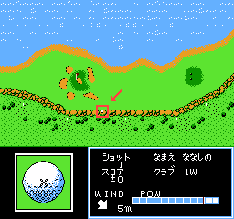

+++
title = "ゴルフッ子オープン (FC) プレイ中イベント発生条件 (暫定)"
date = 2025-08-03

[taxonomies]
tags = ["NES"]
+++

FC版『ゴルフッ子オープン』は、プレイ中に特定条件を満たすと割り込む形でイベントが発生することがある。イベントIDとその概要については既に na6ko 氏による[調査結果](https://na6ko.hatenadiary.jp/entry/20170114/p1)があるが、ここではそれぞれの発生条件も含めて記す (解析が不十分なため、詳細を詰めきれていないものもある)。

わかりにくい用語について予め説明しておく:

* 「ショット回数」とは、1Pが実際にショットを行った回数を指す (OBなどによるペナルティを含まない)。RAM アドレスは `$0659`。
* 「追いつくまでの連続ショット回数」とは、相手に手番が渡るまでに1Pが連続でショットを行った回数を指す (OBなどによるペナルティを含まない)。RAM アドレスは `$0615`。

プレイ中イベントの発生条件テーブルは PRG オフセット `0x19DF7-` に置かれている。ここではこのテーブルで判定されるイベントのみを対象とする。

### イベント一覧

| ID   | イベント名                                       | モード | 相手       | キャディ | ホール | 発生条件 (AND)                                                |
| --   | --                                               | --     | --         | --       | --     | --                                                            |
| 0x00 | プロに怒られる (A)                               | 対COM  | プロ       | てつこ   | 任意   | ショット回数 10 以上 `$04FE` の値が 0 (通常は無視できる?)  |
| 0x01 | ひとみに怒られる                                 | 対COM  | 任意       | ひとみ   | 任意   | ショット回数 12 `$04FE` の値が 0 (通常は無視できる?)       |
| 0x02 | [じいさんがいじける](#event-0x02)                | 対COM  | じいさん   | ちえみ   | 17H    | 15H, 16H で 2 打差以上で負ける ショット回数 0 (256 回打つ) |
| 0x03 | じいさんが釣りをする                             | 対COM  | じいさん   | ひとみ   | 3H     | 追いつくまでの連続ショット回数 3                              |
| 0x04 | [ちょーさんがクラブを賭ける](#event-0x04)        | 対COM  | ちょーさん | 任意     | 1H     | ショット回数 1 まだちょーさんからクラブをもらっていない    |
| 0x05 | ちょーさんとの賭けの結果                         |        |            |          |        | (テーブル外で判定)                                            |
| 0x06 | ちょーさんとの賭けの結果                         |        |            |          |        | (テーブル外で判定)                                            |
| 0x07 | 妖怪スライス出現 -> あしゅら登場                 | 対COM  | ママ       | ひとみ   | 5H     | 3 回連続OB                                                    |
| 0x08 | ママとうさぎ                                     | 対COM  | じいさん   | ちえみ   | 11H    | 4 回連続OB                                                    |
| 0x09 | [ホールインワン (岩に当たって入る)](#event-0x09) | 任意   | 任意       | 任意     | 14H    | 崖の所定の位置に当てるように打つ (下記参照)                   |
| 0x0A | ホールインワン (橋に当たって入る)                | 任意   | 任意       | 任意     | 7H     | 橋に当てるように打つ                                          |
| 0x0B | ホールインワン (岩に当たって入る)                | 任意   | 任意       | 任意     | 12H    | 岩に当てるように打つ                                          |
| 0x0C | はしりタイ出現 -> 小夜ちゃん登場                 | 対COM  | プロ       | ちえみ   | 6H     | 3 回連続OB                                                    |
| 0x0D | ちえみの水着姿                                   | 対COM  | ママ       | 任意     | 15H    | 2 回連続ウォーターハザード                                    |
| 0x0E | 小夜ちゃんの水着姿                               | 対COM  | あしゅら   | ひとみ   | 13H    | 2 回連続ウォーターハザード                                    |
| 0x0F | じいさんにプロテストを勧められる                 |        |            |          |        | (テーブル外で判定)                                            |
| 0x10 | プロに怒られる (B)                               | 対COM  | プロ       | ひとみ   | 11H    | 追いつくまでの連続ショット回数 3                              |
| 0x11 | プロに怒られる?                                  |        |            |          |        | (テーブル外で判定)                                            |
| 0x12 | ひとみになすをもらう                             |        |            |          |        | (テーブル外で判定)                                            |
| 0x13 | 池から宝船が出現                                 | 対COM  | ママ       | てつこ   | 4H     | 2 回連続ウォーターハザード                                    |
| 0x14 | 怖い人にPWを奪われる                             |        |            |          |        | (テーブル外で判定)                                            |
| 0x15 | 怖い人からPWを奪回する                           |        |            |          |        | (テーブル外で判定)                                            |
| 0x16 | ホールインワンもどき?                            |        |            |          |        | (テーブル外で判定)                                            |
| 0x17 | (未調査)                                         |        |            |          |        | (テーブル外で判定)                                            |
| 0x18 | (未調査)                                         |        |            |          |        | (テーブル外で判定)                                            |
| 0x19 | エンディング?                                    |        |            |          |        | (テーブル外で判定)                                            |

### 0x02:じいさんがいじける {#event-0x02}

このイベントを発生させるのはかなり面倒なようである。正確な発生条件 (AND) は以下の通り:

* `$05F9` の値が 2
* ショット回数が 0

`$05F9` はホールごとに定まる値で、直前のホールにおける彼我の打数に依存する。ただし、これ自体の前回の値も `$05FA` に保持されており、これにより `$05F9` がさらに補正されることがある (該当コード: PRG オフセット `0x1B57`)。結論だけ言うと、15H, 16H ともに 2 打差以上で負けていれば `$05F9` の値は 2 になるはずである (大抵は 16H のみで 2 打差で負ければ十分だとは思われる)。

イベント判定はショット回数のカウント後に行われるので、「ショット回数 0」を実現するには 256 回打ってオーバーフローを起こさねばならないと思われる。

### 0x04:ちょーさんがクラブを賭ける {#event-0x04}

`$0665` の bit0 がちょーさんからクラブをもらったかどうかのフラグとなっている。

注意: このフラグは飛距離には影響しない。飛距離に影響するのはプレイヤーの「腕前」(筆者が独自に命名)という値であり、この値が大きいほど飛距離が長くなる。腕前の RAM アドレスは1Pの場合 `$03E0`, 2Pの場合 `$03E1` である。腕前はラウンド終了時にハンディキャップに応じて以下のように更新され、パスワードに記録される:

| ハンデ | 腕前 |
| --     | --   |
| 0      | 4    |
| 1〜9   | 3    |
| 10〜18 | 2    |
| 19〜27 | 1    |
| 28〜   | 0    |

### 0x09:ホールインワン (岩に当たって入る) {#event-0x09}

14Hの画像の位置に打ち込む。

