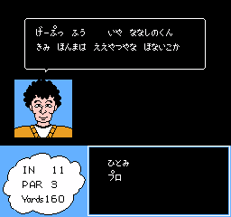
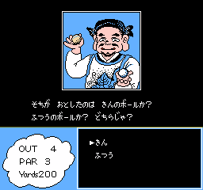

+++
title = "ゴルフッ子オープン (FC) イベント発生条件"
date = 2025-08-03
updated = 2025-08-06

[taxonomies]
tags = ["NES"]
+++

FC版『ゴルフッ子オープン』は、プレイ中に特定条件を満たすと様々なイベントが発生する。イベントIDとその概要については既に na6ko 氏による[調査結果](https://na6ko.hatenadiary.jp/entry/20170114/p1)があるが、ここではその補完を行う。

わかりにくい用語について予め説明しておく:

* 「ショット回数」とは、現在のホール内で1Pが実際にショットを行った回数を指す (OBなどによるペナルティを含まない)。RAM アドレスは `$0659`。
* 「追いつくまでの連続ショット回数」とは、現在のホール内で相手に手番が渡るまでに1Pが連続でショットを行った回数を指す (OBなどによるペナルティを含まない)。RAM アドレスは `$0615`。

プレイ中イベントの発生条件テーブルは PRG オフセット `0x19DF7-` に置かれている。ただし、このテーブルを使わずに判定が行われるイベントもある。

### イベント一覧

| ID     | イベント名                                       | モード | 相手       | キャディ | ホール | 発生条件 (AND)                                                                          |
| --     | --                                               | --     | --         | --       | --     | --                                                                                      |
| 0x00   | [プロに怒られる (A)](#event-0x00)                | 対COM  | プロ       | てつこ   | 任意   | ショット回数 10 以上 `$04FE` の値が 0 (通常は無視できる?)                            |
| 0x01   | [ひとみに怒られる](#event-0x01)                  | 対COM  | 任意       | ひとみ   | 任意   | ショット回数 12 `$04FE` の値が 0 (通常は無視できる?)                                 |
| 0x02   | [じいさんがいじける](#event-0x02)                | 対COM  | じいさん   | ちえみ   | 17H    | 15H, 16H で 2 打差以上で負ける 16Hで1Pが後からカップイン                             |
| 0x03   | [じいさんが釣りをする](#event-0x03)              | 対COM  | じいさん   | ひとみ   | 3H     | 追いつくまでの連続ショット回数 3                                                        |
| 0x04   | [ちょーさんがクラブを賭ける](#event-0x04)        | 対COM  | ちょーさん | 任意     | 1H     | ショット回数 1 まだちょーさんからクラブをもらっていない                              |
| 0x05   | [(未使用)](#event-0x05)                          |        |            |          |        |                                                                                         |
| 0x06   | ちょーさんとの賭けに勝つ                         | 対COM  | ちょーさん | 任意     |        | [ちょーさんがクラブを賭ける](#event-0x04) 参照                                          |
| 0x07   | [妖怪スライス出現 -> あしゅら登場](#event-0x07)  | 対COM  | ママ       | ひとみ   | 5H     | 3 回連続OB                                                                              |
| 0x08   | [ママとうさぎ](#event-0x08)                      | 対COM  | じいさん   | ちえみ   | 11H    | 4 回連続OB                                                                              |
| 0x09   | [ホールインワン (岩に当たって入る)](#event-0x09) | 任意   | 任意       | 任意     | 14H    | 崖の所定の位置に当てるように打つ (下記参照)                                             |
| 0x0A   | ホールインワン (橋に当たって入る)                | 任意   | 任意       | 任意     | 7H     | 橋に当てるように打つ                                                                    |
| 0x0B   | ホールインワン (岩に当たって入る)                | 任意   | 任意       | 任意     | 12H    | 岩に当てるように打つ                                                                    |
| 0x0C   | [はしりタイ出現 -> 小夜ちゃん登場](#event-0x0C)  | 対COM  | プロ       | ちえみ   | 6H     | 3 回連続OB                                                                              |
| 0x0D   | [ちえみの水着姿](#event-0x0D)                    | 対COM  | ママ       | 任意     | 15H    | 2 回連続ウォーターハザード                                                              |
| 0x0E   | [小夜ちゃんの水着姿](#event-0x0E)                | 対COM  | あしゅら   | ひとみ   | 13H    | 2 回連続ウォーターハザード                                                              |
| 0x0F   | [じいさんにプロテストを勧められる](#event-0x0F)  | 対COM  | じいさん   | てつこ   |        | ラウンド終了 (勝敗は任意)                                                               |
| 0x10   | [プロに怒られる (B)](#event-0x10)                | 対COM  | プロ       | ひとみ   | 11H    | 追いつくまでの連続ショット回数 3                                                        |
| 0x11   | [(未使用)](#event-0x11)                          |        |            |          |        |                                                                                         |
| 0x12   | ひとみにナスビをもらう                           | 対COM  | プロ       | ひとみ   | 任意   | 0x10:[プロに怒られる (B)](#event-0x10) 参照                                             |
| 0x13   | [池から宝船が出現](#event-0x13)                  | 対COM  | ママ       | てつこ   | 4H     | 2 回連続ウォーターハザード                                                              |
| 0x14   | [ヤーさんにPWを奪われる](#event-0x14)            | 対COM  | 小夜ちゃん | ちえみ   | 16H    | 1PクラブセットがPWを含む 16H開始時の1Pグロススコア 40 以下 最初のショット時に発生 |
| 0x15   | [ヤーさんからPWを奪回する](#event-0x15)          |        |            |          | 17H    | ヤーさんにPWを奪われている 16Hの1P打数が 3 以内 最初のショット時に発生            |
| 0x16   | (通常ホールインワン用)                           |        |            |          |        | 通常ホールインワンを達成                                                                |
| 0x17   | [(未使用)](#event-0x17)                          |        |            |          |        |                                                                                         |
| 0x18   | [(未使用)](#event-0x18)                          |        |            |          |        |                                                                                         |
| 0x19   | [エンディング](#event-0x19)                      | 対COM  | プロ       | 任意     |        | プロテストでプロに勝つ                                                                  |
| (なし) | ちょーさんとの賭けに負ける                       | 対COM  | ちょーさん | 任意     |        | [ちょーさんがクラブを賭ける](#event-0x04) 参照                                          |
| (なし) | プロに怒られる (C)                               | 対COM  | プロ       | ひとみ   | 任意   | 0x10:[プロに怒られる (B)](#event-0x10) 参照                                             |
| (なし) | [プロテスト敗北](#event-exam-fail)               | 対COM  | プロ       | 任意     |        | プロテストでプロに負ける                                                                |

### 0x00:プロに怒られる (A) {#event-0x00}

   

### 0x01:ひとみに怒られる {#event-0x01}

### 0x02:じいさんがいじける {#event-0x02}

     

このイベントはやや複雑な発生条件 (AND) を持つ:

* `$05F9` の値が 2
* `$C0` の値が 0
* ショット回数が 0

まず `$05F9` はホールごとに定まる値で、直前のホールにおける彼我の打数に依存する。ただし、これ自体の前回の値も `$05FA` に保持されており、これにより `$05F9` がさらに補正されることがある (該当コード: PRG オフセット `0x1B57`)。結論だけ言うと、15H, 16H ともに 2 打差以上で負けていれば `$05F9` の値は 2 になるはずである (大抵は 16H のみで 2 打差で負ければ十分だとは思われる)。

`$C0` の値が 0 という条件を満たすには、前のホール (16H) で1Pが後からカップインする必要がある。通常、この値は1Pの手番では 0 になるのだが、最初のショット時のみ前のホールで最後にカップインしたプレイヤーに依存するようである。  
`$C0` 自体は「現在注目しているプレイヤー」を表すグローバル変数のようだが、これはあちこちでアドホックに書き換えられるため、どこまでが仕様なのかは判然としないところがある。

「ショット回数 0」はホール開始時に自動的に満たされる (COMの手番開始時にイベントが発生する)。

なお、16Hで1Pが先にカップインしてしまった場合は、256 回打ってショット回数をオーバーフローさせれば発生条件を満たすことができる。

### 0x03:じいさんが釣りをする {#event-0x03}

     

### 0x04:ちょーさんがクラブを賭ける {#event-0x04}

   

`$0665` の bit0 がちょーさんからクラブをもらったかどうかのフラグとなっている。このフラグが立っておらず、かつ相手がちょーさんの場合、1Hで 1 回ショットを行うと賭けイベントが発生し、ラウンド終了時に勝敗に応じたイベントが発生する。

注意: ちょーさんからクラブをもらったかどうかは飛距離には影響しない。飛距離に影響するのはプレイヤーの「腕前」(筆者が独自に命名)という値であり、この値が大きいほど飛距離が長くなる。腕前の RAM アドレスは1Pの場合 `$03E0`, 2Pの場合 `$03E1` である。腕前はラウンド終了時にハンディキャップに応じて以下のように更新され、パスワードに記録される:

| ハンデ | 腕前 |
| --     | --   |
| 0      | 4    |
| 1〜9   | 3    |
| 10〜18 | 2    |
| 19〜27 | 1    |
| 28〜   | 0    |

### 0x05:(未使用) {#event-0x05}

これは勝敗に応じてちょーさんとの賭けの結果イベントを実行するものだが、実際には使われていない (イベントシステム外で処理されている)。

### 0x07:妖怪スライス出現 -> あしゅら登場 {#event-0x07}

     

このイベントが発生するとあしゅらと対戦可能なフラグが立つ (`$0665` bit2, パスワードに記録される)。

### 0x08:ママとうさぎ {#event-0x08}

   

「みまわす」からちょーさんとてつこを呼ぶことができるが、てつこを呼ぶとイベントは直ちに終了する。

### 0x09:ホールインワン (岩に当たって入る) {#event-0x09}

14Hの画像の位置に打ち込む。

### 0x0C:はしりタイ出現 -> 小夜ちゃん登場 {#event-0x0C}

     

このイベントが発生すると小夜ちゃんと対戦可能なフラグが立つ (`$0665` bit1, パスワードに記録される)。

### 0x0D:ちえみの水着姿 {#event-0x0D}

 

ちえみがキャディであっても発生する。

### 0x0E:小夜ちゃんの水着姿 {#event-0x0E}

 

小夜ちゃんと対戦可能なフラグが立っていなくても発生する。

### 0x0F:じいさんにプロテストを勧められる {#event-0x0F}

「うん」を選ぶとプロテストフラグ (`$0665` bit3) が立ち、直後に表示されたパスワードで再開するとプロテストが始まる (相手はプロ)。

### 0x10:プロに怒られる (B) {#event-0x10}

このイベントが発生すると、B キーで開くメニューに項目「よぶ」が追加され、プロまたはひとみを呼べるようになる。

 

プロを呼ぶと単に怒られるだけだが、ひとみを呼んでナスビをプロに渡すとプロの機嫌が直る。

   

### 0x11:(未使用) {#event-0x11}

これは [0x10:プロに怒られる (B)](#event-0x10) 発生時に現れる「よぶ」メニューに対応するものだが、実際には使われていない (イベントシステム外で処理されている)。

### 0x13:池から宝船が出現 {#event-0x13}

   

### 0x14:ヤーさんにPWを奪われる {#event-0x14}

このイベントはかなり高難度の発生条件 (AND) を持つ:

* 1PクラブセットがPWを含む
* 16H開始時の1Pグロススコア 40 以下 (つまり、ハンデ抜きで -19 以下)

条件を満たしているとホール上にヤーさんが現れる (Start キーによるプレビューで確認できる):

1Pが最初のショットを行うと、強制的にヤーさんに当たった扱いになってイベントが発生する。どの選択肢を選んでも結果は同じで、1PクラブセットからPWが削除される (パスワードにも記録される)。

     

なお、1Pの最初のショットの行き先はヤーさんがいたあたりのフェアウェイとなる。PWを取り戻すには、ここから16Hを 3 打以内で終えて 0x15:[ヤーさんからPWを奪回する](#event-0x15) を起こす必要がある。

### 0x15:ヤーさんからPWを奪回する {#event-0x15}

0x14:[ヤーさんにPWを奪われる](#event-0x14) が発生した後に16Hを 3 打以内で終えると、ホール上にヤーさんが現れる (Start キーによるプレビューで確認できる):

1Pが最初のショットを行うと、強制的にヤーさんに当たった扱いになってイベントが発生し、1PクラブセットにPWが追加される (パスワードにも記録される)。

   

なお、1Pの最初のショットの行き先はヤーさんがいたあたりのフェアウェイとなる。

### 0x17:(未使用) {#event-0x17}

これはプロとの対戦開始時のメッセージを表示するものだが、実際には使われていない。

### 0x18:(未使用) {#event-0x18}

これはプロテストの勝敗判定用だったと思われるが、実際には使われていない (イベントシステム外で処理されている)。

### 0x19:エンディング {#event-0x19}

プロテスト勝利時に発生する。

   

### プロテスト敗北 {#event-exam-fail}

