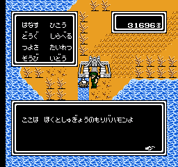

+++
title = "北斗の拳4 (FC) 船と話せるバグ"
date = 2025-03-08

[taxonomies]
tags = ["NES"]
+++

FC版『北斗の拳4』は、船に対して話しかけると全く関係ないセリフを喋るバグがある。

これは、NPCシンボルリストから会話対象を探す際に船も対象となっているのが原因 (船はNPCインデックス 14 で、`$0620-$062F` で管理されている)。本作は船との会話は想定していないため、船に話しかけた際はNPC会話テーブル (PRG 9 `$AA10`) の範囲外を参照し、そこから取得したポインタ経由で会話スクリプトを実行することになる。

フィールド上で船に話しかけた場合はバハモンの村人のセリフを喋るだけだが、船に乗ったまま[ムーンウォークバグ](https://www.nicovideo.jp/watch/sm43281068)を行うと他のマップにも船を持ち込むことができ、その状態で船に話しかけるとマップID `$9A` に応じて会話の内容が変化する(会話テーブルはマップごとに設定されているため)。

マップによっては会話スクリプトポインタが RAM 上に設定されることがあり、この場合不正なテキストスクリプトIDが実行されてバグったセリフを喋ることもある。たとえば、イベリアまたはデスロレンスに船を持ち込んで会話すると `$90-` から会話スクリプトが読み込まれ、会話タイミングにより様々なバグり方をする (NMI カウンタ `$91` および後続の雑用変数の値に依存)。

もし、このバグを用いてテキストスクリプトID 0x00A0 を実行することができればエンディングフラグ `$ED` が 1 になり、直ちにエンディングが始まる。ただし、全マップについて調べたところ、会話スクリプトポインタを制御しやすい RAM 領域に設定できるケースは見つからなかった。筆者が試行錯誤した限り、最も有望そうなのはラフレンス (`$6D-` を会話スクリプトとして実行) で、これは七星光の残り時間タイマー `$8D-$8E` をテキストスクリプトIDとして利用できる可能性があるが、必要なイベントフラグを立てられないなどの問題があり、今のところエンディング直行は実現できていない。
