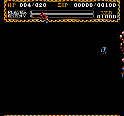

+++
title = "イース1 (FC) クラッシュバグ"
date = 2025-03-20

[taxonomies]
tags = ["NES"]
+++

FC版『イース1』には CPU が暴走するバグがある。

正確な発生条件は未解析だが、ゲーム開始直後に素手でザコを壁際に押し付けつつ相討ちすると CPU が暴走することがある(大抵は画面が崩れてフリーズする)。

このバグは以下の環境で再現することを確認している:

* 筆者所有のニューファミコン
* BizHawk 2.10, NesHawk core ([movie](Ys1-CrashGlitch-bizhawk.zip))
* FCEUX 2.6.6 ([movie](Ys1-CrashGlitch-fceux.zip))
* Mesen2 commit 16d6d70376916f0e8ef9f88d11425bd5573d537a

これは、スレッド間の排他制御が甘いため、特定のタイミングで NMI が発生するとバンク切り替えが壊れるのが原因と思われる。たとえば上記の BizHawk 上のムービーでは以下のような挙動を示す:

* 素手でザコを壁際に押し付けつつ相討ちした瞬間、NMI ハンドラの処理に長い時間がかかる。
* NMI ハンドラが終了してメインスレッドが再開するが、すぐに NMI が再発生する。このとき、メインスレッドは PRG 5 のコードを実行中である。
* NMI ハンドラが実行され、PRG 14 に切り替えて戻る (本作は NMI 発生時は常に PRG 14 がロードされていると仮定しているようだが、これが成り立っていない)。
* メインスレッドは PRG 5 のコードを実行していたのに、PRG 14 の同じアドレスから実行を再開してしまい、暴走する。

これは TAS に応用できればかなり早くクリアできそうだが、制御はさほど簡単ではないと思われる。なお、実は CPU が暴走しているが、そのままゲームオーバーになるというケースも確認している (この場合画面右端が少し崩れていた)。
