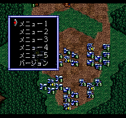

+++
title = "アースライト ルナ・ストライク (SFC) 拡張デバッグメニュー"
date = 2024-12-01

[taxonomies]
tags = ["SNES"]
+++

SFC版『アースライト ルナ・ストライク』にはデバッグモードが存在する。
アクセス方法は以下の通り ([TCRF](https://tcrf.net/Earth_Light:_Luna_Strike) にも載っている):

* オープニング中に Down+B を押しながら R を押すことを 3 回繰り返し、Start でタイトル画面へ遷移する。
  これによりデバッグモードが有効化される。
* タイトル画面から Left+Start でゲームを開始する。
* 戦術シーンの自軍フェイズ中に B+L を押すとデバッグメニューが起動する。

実はこれをさらに拡張したデバッグメニューも実装されているが、製品版では無効化されている。
これを有効化するには、ROM 論理アドレス `$C426AD` を 0 から 1 に書き換えればよい。この状態で上記の通りにデバッグモードを有効化し、自軍フェイズ中に B+R を押すと、以下のような拡張デバッグメニューが起動する:

この拡張デバッグメニューではクリア称号表示などができる。
